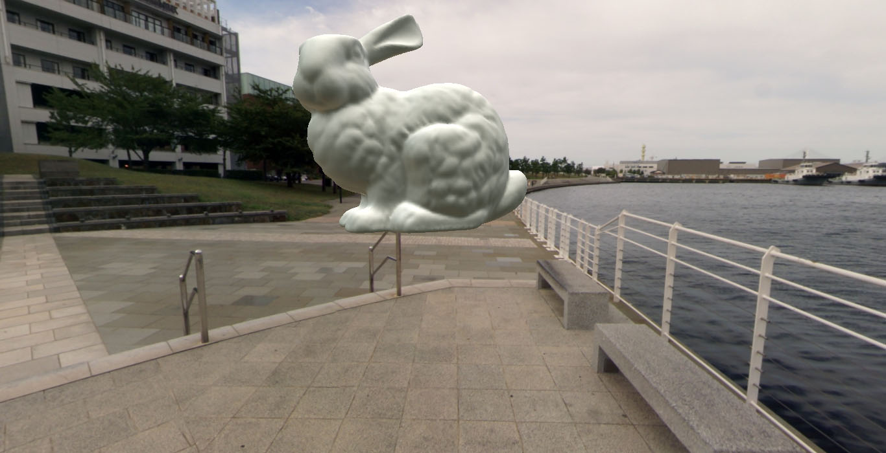

# 球谐光照

|   |   |   |
|---|---|---|

[演示视频](https://www.bilibili.com/video/av48910058/)

## 简介

给定环境贴图，对环境光进行采样，得到数据量很小的环境光参数。利用这些参数对场景或者模型加上环境光照，详细内容参考[实验篇](https://lianera.github.io/post/2016/sh-lighting-exp/)以及[应用篇](https://lianera.github.io/post/2017/sh-lighting-apply/)

程序包含三个部分：

* [Framework](framework)：框架
* [Spherical Harmonics Sampler](sampler)：球谐光照采样器
* [Spherical Harmonics Lighting](lighting)：球谐光照渲染器

## 运行

使用sample_all.sh进行采样，加上--write-rendered可以用球谐参数直接生成CubeMap

运行rendering_all.sh查看渲染效果

鼠标左键拖动转动模型，鼠标右键拖动转动场景，鼠标滚轮进行缩放，PageUp/PageDown切换场景，上/下箭头切换模型，数字键0/1/2/3切换球谐阶数

## 环境

* Visual Studio 2017
* 第三方库：OpenGL, Glfw3, Glew, stb_image （推荐使用vcpkg安装第三方库）